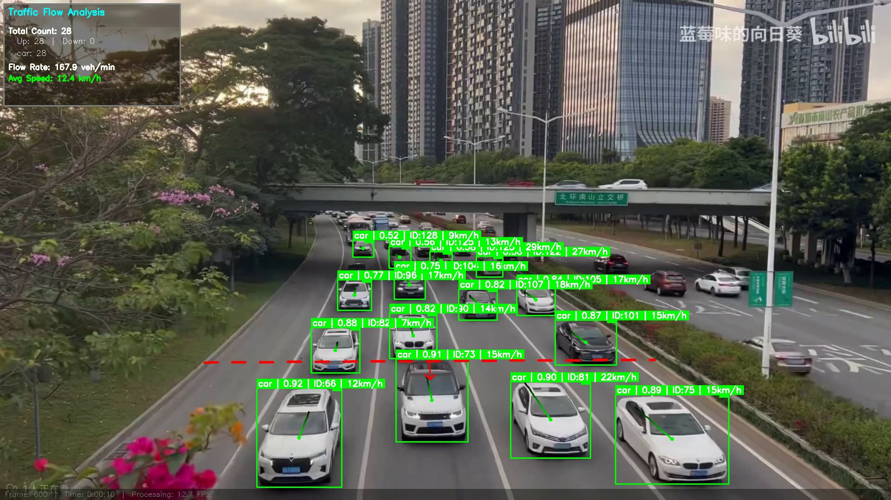
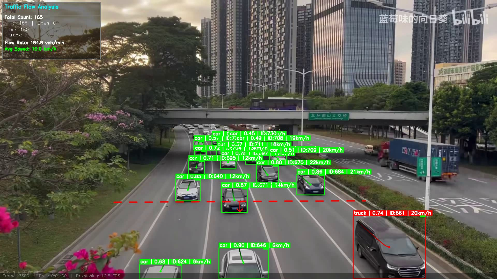
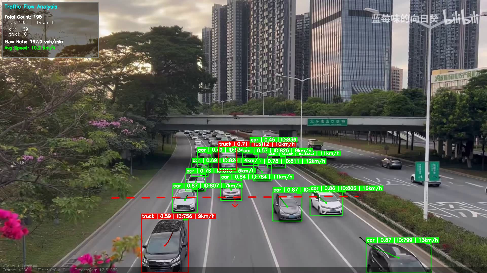

# 交通流量分析系统

基于 YOLOv8 + Bot-SORT 的完整交通流量分析 pipeline：**车辆检测 → 多目标跟踪 → 越线计数 → 速度估计 → 数据可视化 → 统计报告**。

## 项目架构

```
d:\交通流量\
├── src/
│   ├── main.py                 # 主流程编排 + 交互标定 UI + 数据收集
│   ├── config.py               # 集中配置 + 标定参数持久化
│   ├── detector.py             # YOLO 检测器 + ROI 空间过滤
│   ├── tracker.py              # 目标轨迹管理器
│   ├── counter.py              # 虚拟线越线计数
│   ├── speed_estimator.py      # 透视变换速度估计
│   ├── visualizer.py           # 逐帧可视化引擎
│   └── analytics.py            # 离线图表生成 (matplotlib)
├── screenshots/                # 效果截图
├── calibration.json            # 标定数据 (跨次运行复用)
├── Traffic1.mp4                # 输入视频
└── output/                     # 输出目录
    ├── result_{model}.mp4       # 标注后的结果视频
    └── charts_{model}/          # 分析图表 (5张)
```

## 数据流

```
Traffic1.mp4 (1920×1080)
  │
  ▼
┌──────────────────────────────────────────────┐
│  VehicleDetector.detect_with_tracking()       │
│  YOLO 检测 → Bot-SORT 跟踪 → ROI 空间过滤     │
└──────────────┬───────────────────────────────┘
               │
     ┌─────────┼─────────┬──────────────┐
     ▼         ▼         ▼              ▼
  Tracker   SpeedEst  LineCounter   DataCollector
  轨迹历史  鸟瞰图速度  叉积判越线    速度样本/事件
     │         │         │              │
     └─────────┼─────────┘              │
               ▼                        │
         Visualizer                     │
         逐帧绘制叠加                    │
               │                        │
               ▼                        ▼
        输出视频 + JSON报告 + 5张分析图表
```

## 功能特性

### 检测与跟踪
- YOLOv8 多模型支持：`v8s` / `v8m` / `v8x`
- Bot-SORT 多目标跟踪 (`persist=True`)
- 车辆类别过滤：car / truck / bus / motorcycle
- **ROI 多边形空间过滤**：只检测目标车道，排除对向车流

### 速度估计
- **透视变换 → 鸟瞰图**：消除摄像头梯形畸变，速度计算准确
- 道路宽度标定：画面中 4 点 → 输入实际宽度（米）→ 自动计算变换矩阵
- 移动平均平滑（6帧窗口），剔除异常值（<2 或 >200 km/h）
- 颜色编码：绿色 (<40) / 黄色 (40-80) / 红色 (>80) km/h

### 越线计数
- 虚拟计数线（鼠标交互标定）
- 叉积法判断越线方向
- **线段限制**：只统计从线段经过的车辆，排除延长线上的误判
- 每个 track ID 只计一次

### 可视化（每帧叠加 12 个元素）
- 检测框 + 类别标签 + 置信度 + 跟踪 ID
- 瞬时速度标注 + 色块
- 最近 20 帧轨迹线（渐透明）
- 计数线（红色虚线）+ 方向箭头
- 左上角仪表盘：实时计数 / 车流量 / 平均速度
- 底部状态栏：帧号 / 时间戳 / 处理 FPS

### 统计分析
- 5 张分析图表：流量曲线 / 车型分布饼图 / 速度分布直方图 / 方向柱状图 / 综合仪表盘
- JSON 完整报告：所有计数事件 + 每条 track 的速度序列
- 异常 track 过滤：`max(speed) > 150 km/h` 视为 ID 跳变噪声，整条剔除

## 快速开始

### 环境要求

- Python 3.10+
- CUDA 可用 GPU (RTX 3060+ 推荐)
- ultralytics, opencv-python, numpy, matplotlib

```bash
pip install ultralytics opencv-python matplotlib numpy
```

### 1. 标定（首次运行必须）

```bash
python src/main.py --calibrate
```

三步交互标定：
1. **计数线**：在画面上点击 2 个点，画一条横穿道路的线
2. **道路宽度**：点击 4 个点（远处左、远处右、近处左、近处右），输入实际路宽（米）
3. **ROI 多边形**：顺时针点击 4+ 个点，圈出你要分析的车道

操作：左键加点 | Enter 确认 | Backspace 撤销 | ESC 取消

标定结果保存到 `calibration.json`，下次直接运行不需要重新标定。

### 2. 运行分析

```bash
# 选择模型运行（推荐 v8x）
python src/main.py --model v8x

# 或交互选择
python src/main.py
```

### 3. 查看结果

```bash
# 打开标注后的结果视频
start output/result_v8x.mp4

# 查看统计报告
cat output/report_v8x.json
```

## 效果展示

| 前期 | 中期 | 后期 |
|------|------|------|
|  |  |  |

> 标注内容：检测框 + 类别标签 + 置信度 + 轨迹线 + 速度 + 仪表盘

## 模型对比

对同一段 5 车道公路视频（12fps，约 6.9 分钟）的实测结果：

| 指标 | v8s | v8m | v8x |
|------|-----|-----|-----|
| 总计数 | 244 | 237 | 237 |
| 反向误计 | 1 ⚠ | 0 ✅ | 0 ✅ |
| 平均速度 | 11.3 | 10.9 | 11.0 km/h |
| 最高速度 | 79.1 | 100.8 ⚠ | 83.1 km/h |
| car / truck / bus / moto | 216/26/1/1 | 229/7/0/1 | **227/9/0/1** |
| 跟踪 ID 数 | 315 | 289 | **277** ← 最稳定 |
| 检出框总数 | 63,340 | 67,196 | **74,833** |
| 处理 FPS | 13.6 | 13.5 | 12.8 |

> **结论**：v8x 跟踪最稳定（最少 ID 跳变）、检出最多、分类合理、速度可信。
> v8s 存在 truck 误分类（26辆 vs v8x 9辆）和反向计数问题。
> v8m 最高速度 100.8 km/h 偏高，疑似跟踪噪声。
> **推荐使用 v8x。**

## 关键问题与解决方案

### 1. 梯形画面速度不准

**问题**：摄像头斜拍公路，画面中远处 px/m ≠ 近处 px/m，直接用像素位移算速度会严重偏低。

**方案**：透视变换 → 鸟瞰图。标定时在画面中标记道路 4 个角（梯形），输入实际路宽（米）。系统自动计算 `cv2.getPerspectiveTransform`，在鸟瞰图中 px/m 处处均匀，速度准确。

### 2. 对向车道车辆混入

**问题**：画面右侧是反方向 5 车道，YOLO 会检测到其中车辆并参与计数和速度统计。

**方案**：ROI 多边形空间过滤。标定时用鼠标框出目标车道，`cv2.pointPolygonTest` 在检测层直接过滤。源头截断，下游模块不感知。

### 3. 延长线上的误计数

**问题**：叉积判断的是"越过直线"，线延伸到画面外的车也会触发计数。

**方案**：增加 `_on_segment()` 限制——车辆质心垂直距离离线段 > 80px 不计数。

### 4. 跟踪 ID 跳变产生假高速

**问题**：Bot-SORT 在密集车流中可能切换 ID，track A 的质心跳到 track B，位移量巨大 → 算出 178/192 km/h。

**方案**：速度范围过滤（2-200 km/h）+ 整条 track 检查（`max(speeds) > 150` → 剔除）。

### 5. 两车合并导致反向计数

**问题**：两车紧跟过线时 Bot-SORT 合并为一个框 → 框拉长 → 质心跳转 → 叉积符号翻转 → 误判反向。v8s 出现 1 例。

**方案**：升级模型。v8m/v8x 跟踪更稳定，0 反向计数。

## 配置说明

`config.py` 中关键参数：

```python
CONFIDENCE_THRESHOLD = 0.4    # 检测置信度阈值
IOU_THRESHOLD = 0.5          # NMS 阈值
SPEED_SMOOTH_WINDOW = 6      # 速度平滑窗口（帧数）
TRAIL_LENGTH = 20            # 轨迹线长度
STATS_INTERVAL_SECONDS = 30  # 统计时间片
```

可视化开关：`SHOW_BOXES` / `SHOW_LABELS` / `SHOW_SPEED` / `SHOW_TRAILS` / `SHOW_DASHBOARD` 等。

## License

MIT
